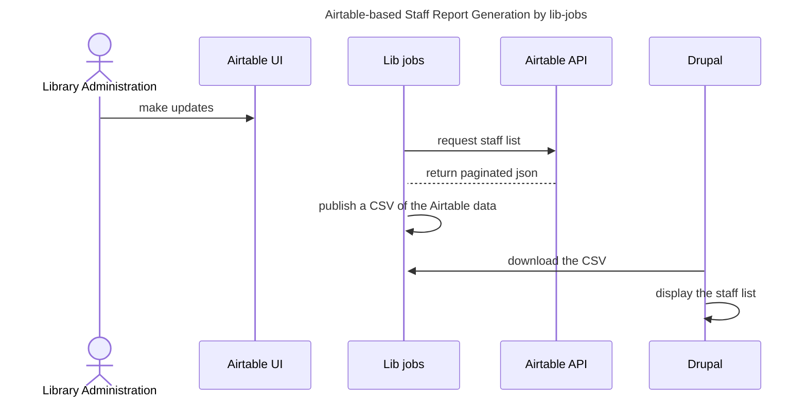

# Web Staff
  This generates the staff report from data in an Airtable.  It
  creates a CSV that can then be used by the OIT WDS-hosted
  library website.

## Accessing the data in the Airtable UI and API

* [Airtable UI for staff directory data](https://airtable.com/appv7XA5FWS7DG9oe/tblM0iymGN5oqDUVm/viwHf9IPWSnVpidzL?blocks=hide)
* [API docs for Library Staff Airtable](https://airtable.com/appv7XA5FWS7DG9oe/api/docs)
* [Auth docs for Airtable](https://airtable.com/developers/web/api/authentication)

If you don't have access to the above, @jpstroop can
set you up.

Lib-jobs uses a personal access token (PAT) from a service
account to authenticate into airtable.  For local
development, you can use that token, or create your
own PAT in the Airtable UI.  Instructions for rotating
the airtable service account PAT can be found in the
lib-jobs ansible vault.

## Sequence of events

The steps to maintain this list, as illustrated in the sequence diagram below.
1. Library Administration staff make updates in the Airtable UI.
1. Lib jobs requests a staff list from the Airtable API
1. The Airtable API returns a paginated JSON response
1. Lib-jobs publishes a CSV of the Airtable data
1. Drupal downloads the CSV
1. Drupal displays the staff list

