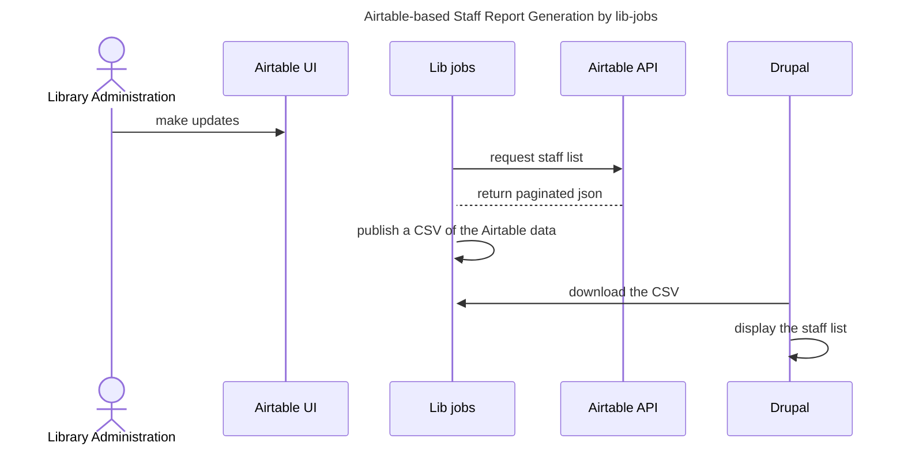

# Web Staff
  This generates the staff report from data in an Airtable.  It
  creates a CSV that can then be used by the OIT WDS-hosted
  library website.

## Sequence of events

The steps to maintain this list, as illustrated in the sequence diagram below.
1. Library Administration staff make updates in the Airtable UI.
1. Lib jobs requests a staff list from the Airtable API
1. The Airtable API returns a paginated JSON response
1. Lib-jobs publishes a CSV of the Airtable data
1. Drupal downloads the CSV
1. Drupal displays the staff list

