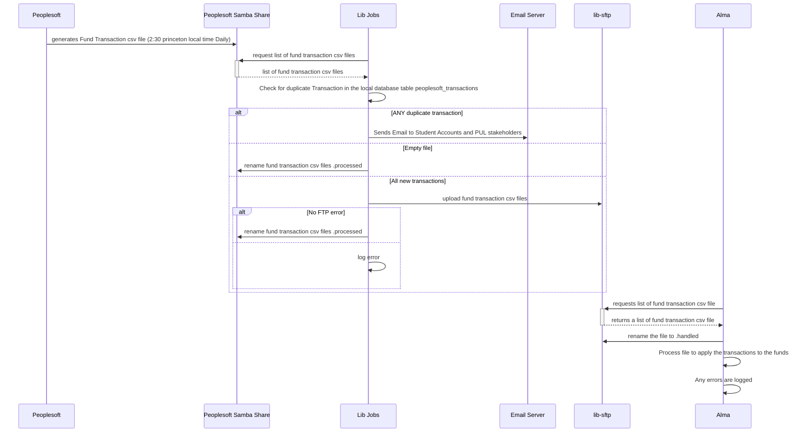

# Alma Fund Adjustment
  This job moves Peoplesoft Transactions from Peoplesoft to Alma to keep the fund balances in Alma in sync with the fund balances in Peoplesoft.  These are any expeses not accounted for in Alma for material purchases like a book, or paying a UPS bill.

## Flow Diagrams

