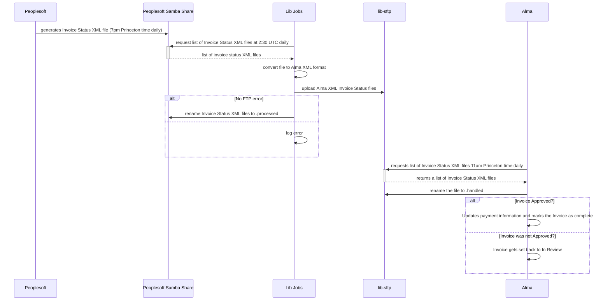

# Alma invoice status
  This job moves Invoice Status information from Peoplesoft to Alma.

## Flow Diagrams

```mermaid
sequenceDiagram
    Peoplesoft->>Peoplesoft Samba Share: generates Invoice Status XML file (7pm Princeton time daily)
    Lib Jobs->>+Peoplesoft Samba Share: request list of Invoice Status XML files at 2:30 UTC daily
    Peoplesoft Samba Share-->>-Lib Jobs: list of invoice status XML files
    Lib Jobs->>Lib Jobs: convert file to Alma XML format
    Lib Jobs->>lib-sftp: upload Alma XML Invoice Status files
    alt No FTP error
      Lib Jobs->>Peoplesoft Samba Share: rename Invoice Status XML files to .processed
    else
      Lib Jobs->>Lib Jobs: log error
    end
    Alma->>+lib-sftp: requests list of Invoice Status XML files 11am Princeton time daily
    lib-sftp-->>-Alma: returns a list of Invoice Status XML files
    Alma->>lib-sftp: rename the file to .handled
    alt Invoice Approved?
      Alma->>Alma: Updates payment information and marks the Invoice as complete
    else Invoice was not Approved?
      Alma->>Alma: Invoice gets set back to In Review
    end
```
