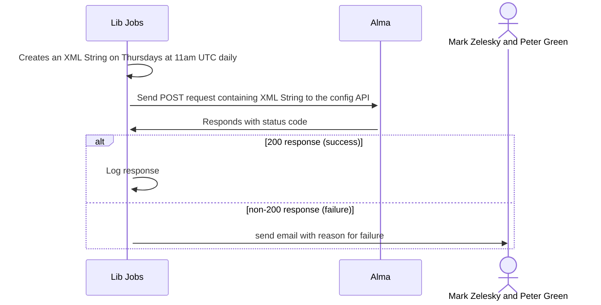

# Alma Normalization Process
  The purpose of this job is to move OCLC numbers from the 914 field into the 035 file and remove any existing 035 fields that have an OCLC field. The job is called via Alma's "config" API.  At some future time it may be utilized to disable accounts.

## Flow Diagrams

