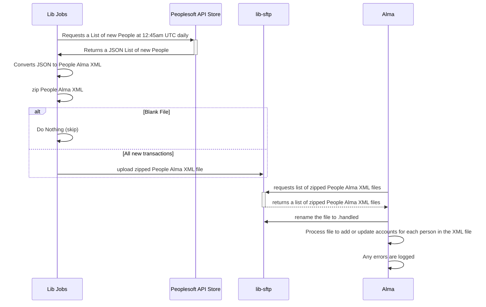

# Alma People
  This job moves updates from Peoplesoft API Store to Alma to keep the accounts in alma up to date.  This currently just adds accounts.  At some future time it may be utilized to disable accounts.

## Flow Diagrams

