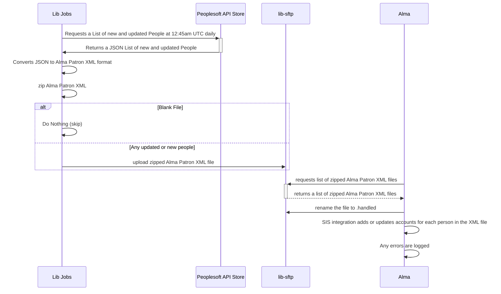

# Alma People
  This job moves updates from Peoplesoft API Store to Alma to keep the accounts in alma up to date.  This currently just adds and updates accounts.  At some future time it may be utilized to disable accounts.

## Flow Diagrams

* SIS stands for Student Information System.
* To check the status in Alma, go to Admin > Monitor Jobs > History Tab. Search for a job named "Users SYNCHRONIZE using profile Student Information System".
* To check the Peoplesoft API store, go to https://api-store.princeton.edu/store. Log in using the "Library Api Store User" credentials from Lastpass. Under Applications, choose AlmaDailyPatronFeed and generate a new token. Under APIs, you can use that token in the Swagger UI to interact with the LibAlma API.
