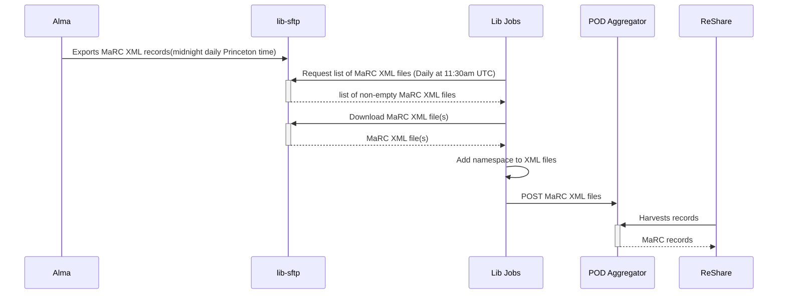

# Alma Pod Records

This job cleans up MARC records from Alma and sends them to the [POD project](https://github.com/pod4lib/aggregator/wiki).

Alma exports the MarcXML records through the "POD Project Publishing" publishing profile.

You can see all uploaded files in our [POD Aggregator Organization page](https://pod.stanford.edu/organizations/princeton).

## Flow Diagrams

## Publish the full dump from Alma
- Go to Alma -> Resources -> Publishing Profiles
- Click triple dots next to the Pod Project Publishing profile and select "Republish"
- For Publishing Mode select Rebuild Entire Index
- This process takes around [X] amount of time to run 
