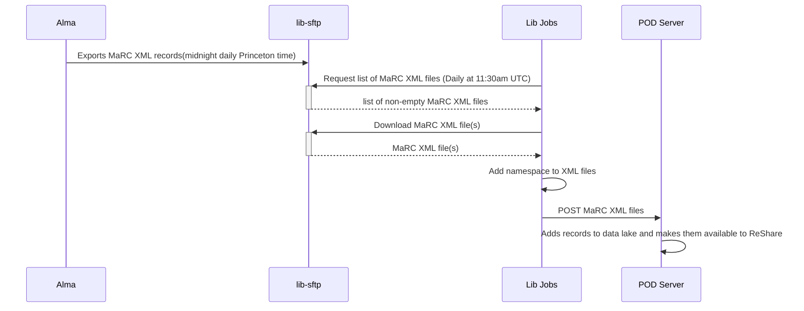

# Alma Pod Records

This job cleans up MARC records from Alma and sends them to the [POD project](https://github.com/pod4lib/aggregator/wiki).

## Flow Diagrams

Alma exports the MarcXML records through the "POD Project Publishing" publishing profile.
