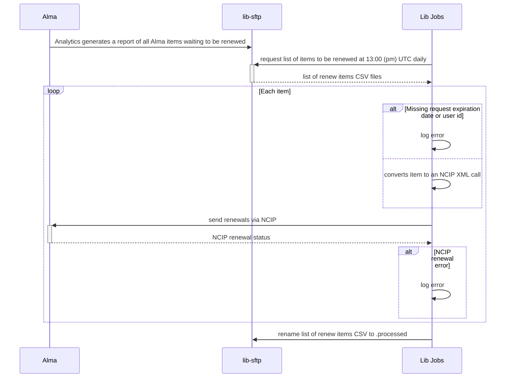

# Alma Renew
  This automatically renews items in Alma via NCIP calls

## Flow Diagrams

```mermaid
sequenceDiagram
    accTitle: Renewal of items in Alma via NCIP calls.
    accDescr {
        Analytics generates a report of all Alma items waiting to be renewed.
        Lib Jobs requests a list of items to be renewed at 13:00 (pm) UTC daily and receives the list from lib-sftp.
        Lib Jobs converts each item to an NCIP XML call provided it has an expiration date and user id. Otherwise, it logs an error.
        Lib Jobs sends the renewals to Alma via NCIP, and receives a NCIP renewal status. Lib Jobs logs any errors and sends lib-sftp a renamed list (to .processed) of renew items CSV.
}
    Alma->>lib-sftp: Analytics generates a report of all Alma items waiting to be renewed
    Lib Jobs->>+lib-sftp: request list of items to be renewed at 13:00 (pm) UTC daily
    lib-sftp-->>-Lib Jobs: list of renew items CSV files
    loop Each item
      alt Missing request expiration date or user id
        Lib Jobs->>Lib Jobs: log error
      else
        Lib Jobs->>Lib Jobs: converts item to an NCIP XML call
      end
      Lib Jobs->>+Alma: send renewals via NCIP
      Alma-->>-Lib Jobs: NCIP renewal status
      alt NCIP renewal error
        Lib Jobs->>Lib Jobs: log error      
      end
    end
    Lib Jobs->>lib-sftp: rename list of renew items CSV to .processed
```
