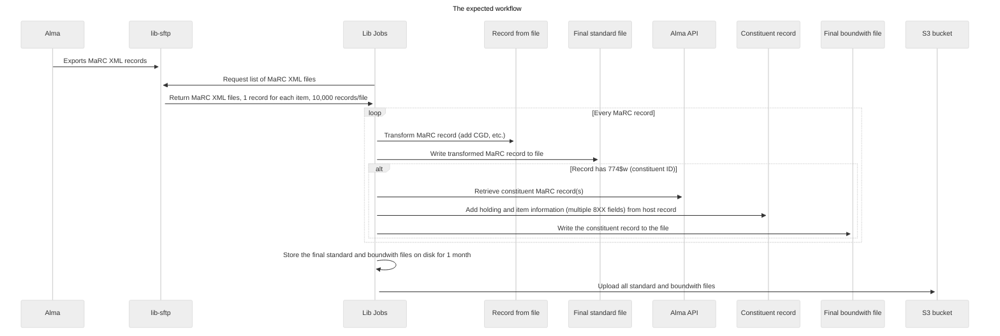

```mermaid
---
title: The expected workflow
---
sequenceDiagram
%%{init: {'theme': 'neutral', 'themeVariables': {'background': '#aaa'}}}%%
    Alma->>+lib-sftp: Exports MaRC XML records
    Lib Jobs->>+lib-sftp: Request list of MaRC XML files
    lib-sftp->>+Lib Jobs: Return MaRC XML files, 1 record for each item, 10,000 records/file
    loop Every MaRC record
      Lib Jobs->>+Record from file: Transform MaRC record (add CGD, etc.)
      Lib Jobs->>+Final standard file: Write transformed MaRC record to file
      alt Record has 774$w (constituent ID)
        Lib Jobs->>+Alma API: Retrieve constituent MaRC record(s)
        Lib Jobs->>+Constituent record: Add holding and item information (multiple 8XX fields) from host record
        Lib Jobs->>+Final boundwith file: Write the constituent record to the file
      end
    end
    Lib Jobs->>+Lib Jobs: Store the final standard and boundwith files on disk for 1 month
    Lib Jobs->>+S3 bucket: Upload all standard and boundwith files
```
