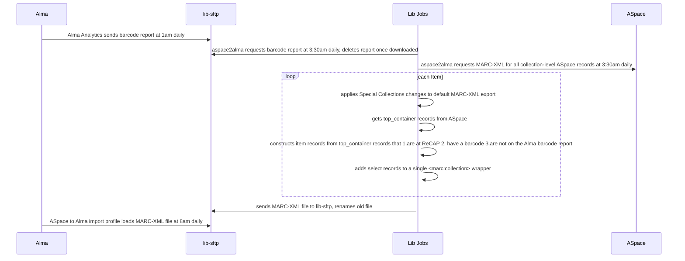

This workflow loads select collection-level archival records from ArchivesSpace to Alma. It runs daily.

### Key
[whenever job](https://github.com/pulibrary/aspace_helpers/blob/main/config/schedule.rb)

Alma import profile: Resources > Manage Import Profiles > ASpace to Alma
