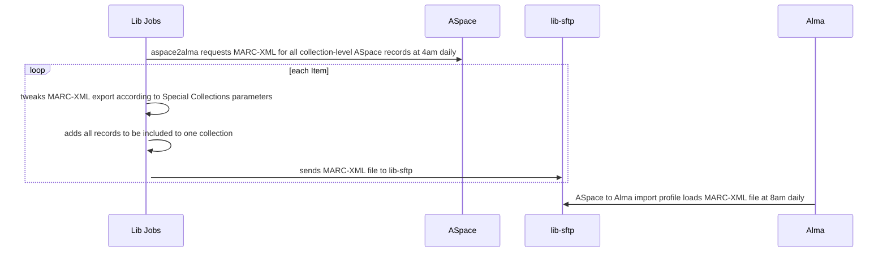

This workflow loads select collection-level archival records from ArchivesSpace to Alma. It runs daily.

```mermaid
sequenceDiagram
Lib Jobs->>ASpace: aspace2alma requests MARC-XML for all collection-level ASpace records at 4am daily
loop each Item
  Lib Jobs->>+Lib Jobs: tweaks MARC-XML export according to Special Collections parameters
  Lib Jobs->>+Lib Jobs: adds all records to be included to one collection
  Lib Jobs->>lib-sftp: sends MARC-XML file to lib-sftp
end
Alma->>lib-sftp: ASpace to Alma import profile loads MARC-XML file at 8am daily
```