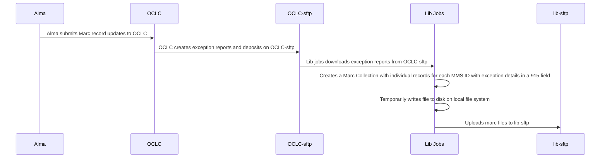

This job downloads BibException reports from OCLC-sftp, creates a Marc Collection with individual records for each MMS ID, and uploads the file with the Marc Collection to lib-sftp, in preparation for further processing by Alma.

