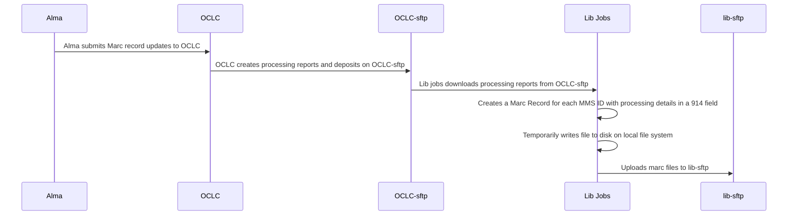

This job downloads BibProcessing reports from OCLC-sftp, creates a Marc record for each MMS ID, and uploads the file with the Marc records to lib-sftp, for ingest into Alma.

```mermaid
sequenceDiagram
accTitle: Diagram depicting processing of Bib processing reports from OCLC
accDescr {
- Alma submits Marc record updates to OCLC for datasync every Tuesday at 7 pm
- OCLC takes 4-6 hours to process the updates from Alma and create processing reports, which it puts on the OCLC sftp server
- This job
  - Downloads all "processing" files that have been created in the past week
  - Creates a Marc Record for each MMS ID
    - Each stub Marc record has an 001 field with the MMS ID, and a 914 field with the information from the OCLC record about how the MMS ID was processed.
  - Temporarily writes file to disk on local file system
  - Uploads Marc files to lib-sftp
}
Alma->>OCLC: Alma submits Marc record updates to OCLC
OCLC->>OCLC-sftp: OCLC creates processing reports and deposits on OCLC-sftp
OCLC-sftp->>Lib Jobs: Lib jobs downloads processing reports from OCLC-sftp
Lib Jobs->>Lib Jobs: Creates a Marc Record for each MMS ID with processing details in a 914 field
Lib Jobs->>Lib Jobs: Temporarily writes file to disk on local file system
Lib Jobs->>lib-sftp: Uploads marc files to lib-sftp
```
