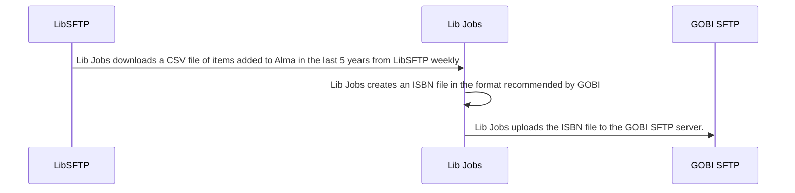

# GOBI ISBN Holdings Job
This workflow gets the records of all items added to Alma in the last 5 years and creates an ISBN export file for export to GOBI. This is to help prevent us from purchasing an item we already own.

## Flow Diagram

