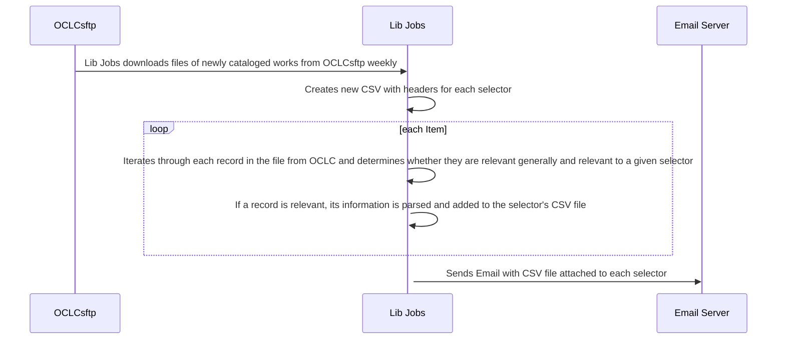

This workflow sends CSV files listing books that have recently been cataloged by the Library of Congress to selectors who may be interested in those books.

```mermaid
sequenceDiagram
accTitle: Diagram depicting generating and sending a CSV of recently cataloged books to selectors who may be interested in those books.
accDescr {
  Lib Jobs downloads files of newly cataloged works from OCLCsftp weekly.
  Lib Jobs creates new CSV with headers for each selector.
  Lib Jobs iterates through each record in the file from OCLC and determines whether they are relevant generally and relevant to a given selector.
  If a record is relevant, its information is parsed and added to the selector's CSV file.
  Lib Jobs sends an email with CSV file attached to each selector.
}
OCLCsftp->>Lib Jobs: Lib Jobs downloads files of newly cataloged works from OCLCsftp weekly
Lib Jobs->>Lib Jobs: Creates new CSV with headers for each selector
loop each Item
  Lib Jobs->>+Lib Jobs: Iterates through each record in the file from OCLC and determines whether they are relevant generally and relevant to a given selector
  Lib Jobs->>+Lib Jobs: If a record is relevant, its information is parsed and added to the selector's CSV file
end
Lib Jobs->>Email Server: Sends Email with CSV file attached to each selector
```
