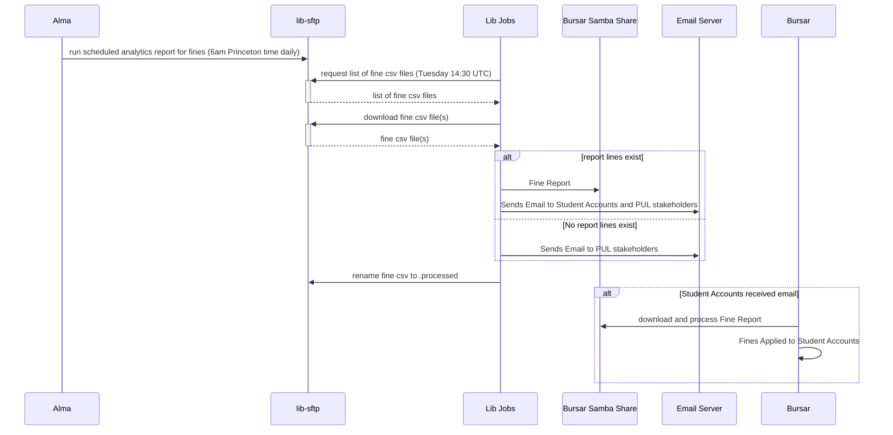
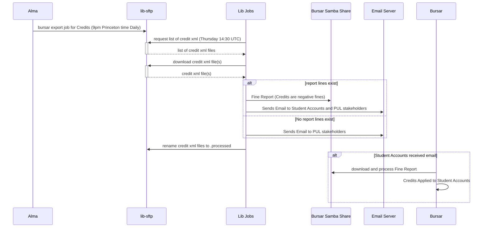

# PeopleSoft Bursar
  This job moves fines and credits from Alma to student accounting.  Fines are not generated for staff and faculty.  Folks in finance have access to the end product, but other do not have access to the system.

## Flow Diagrams

### Fines Process

### Credits Process

