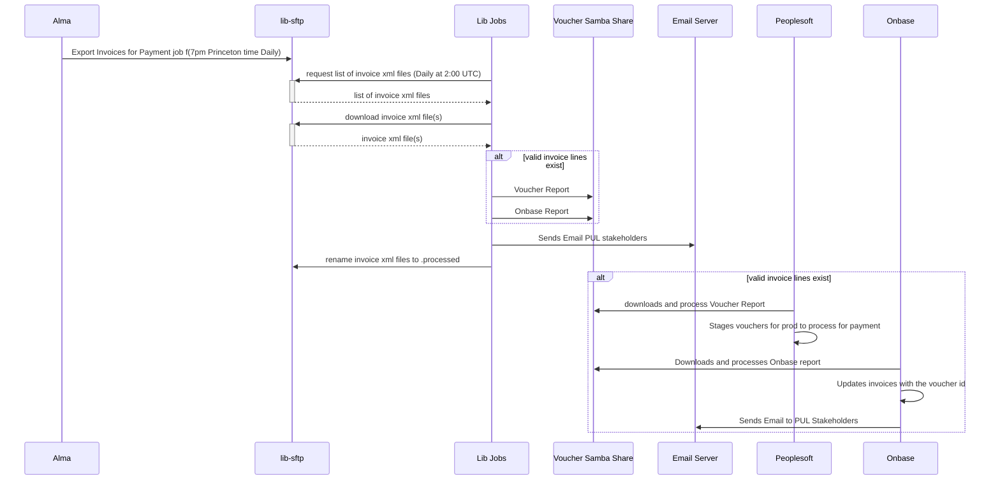

# PeopleSoft Voucher
  This job transforms invoices from Alma to vouchers for peoplesoft.  Invoices are ready to be sent to peoplesoft when staff approve an invoice for payment.  These invoices can be for physical items, shipping changes, or anything really.

## Flow Diagrams

## Turning the job on and off

To turn this job on or off:
1. Go to [the flipflop dashboard](https://lib-jobs.princeton.edu/features)
1. In the active_record column, press the on or off button
