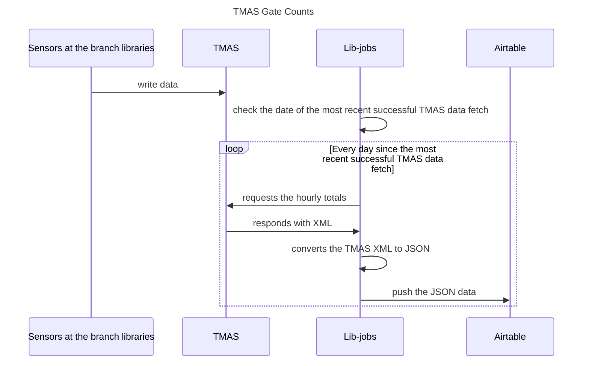

# TMAS Gate Counts
This gets data about foot traffic at our branch libraries from the
TMAS system, then writes it to AirTable where it can be analyzed.

## Sequence of events

The steps of this job, as illustrated in the sequence diagram below.
1. Sensors at the branch libraries write data to TMAS
1. Lib-jobs checks the date of the most recent successful TMAS data fetch
1. For each day since the most recent successful TMAS data fetch:
    1. Lib-jobs requests the hourly totals from TMAS
    1. TMAS responds to Lib-jobs with XML
    1. Lib-jobs converts the TMAS XML to JSON
    1. Lib-jobs pushes the JSON data to Airtable

