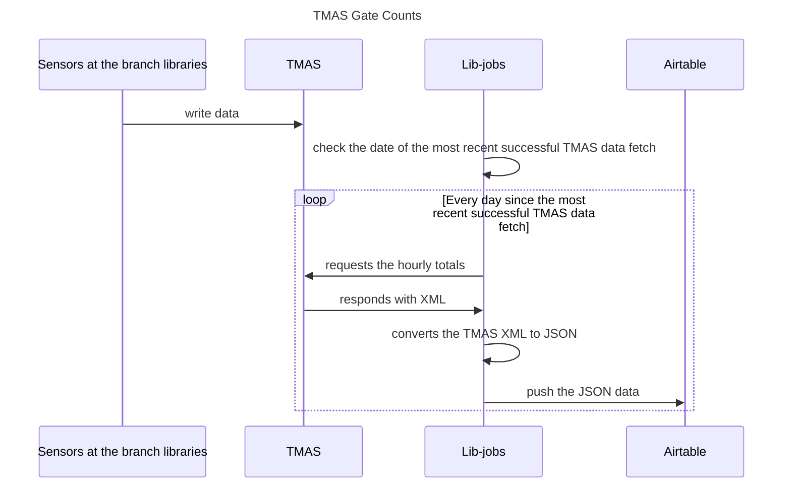

# TMAS Gate Counts
This gets data about foot traffic at our branch libraries from the
TMAS system, then writes it to AirTable where it can be analyzed.

## Airtable

* [Airtable UI for counter data](https://airtable.com/appAqHrmsuH7VsZOB/tblLkWS3cZh8YqlgN/viw3hQqzoWCWFMjuo) - its name is Pearl People Counter Data
* [API docs for counter data](https://airtable.com/appAqHrmsuH7VsZOB/api/docs)
* [Auth docs for Airtable](https://airtable.com/developers/web/api/authentication)

Lib-jobs uses a personal access token (PAT) from a service
account to authenticate into airtable.  For local
development, you can use that token, or create your
own PAT in the Airtable UI.  Instructions for rotating
the airtable service account PAT can be found in the
lib-jobs ansible vault.

Note that we use separate PATs for each Airtable Base.

## Sequence of events

The steps of this job, as illustrated in the sequence diagram below.
1. Sensors at the branch libraries write data to TMAS
1. Lib-jobs checks the date of the most recent successful TMAS data fetch
1. For each day since the most recent successful TMAS data fetch:
    1. Lib-jobs requests the hourly totals from TMAS
    1. TMAS responds to Lib-jobs with XML
    1. Lib-jobs converts the TMAS XML to JSON
    1. Lib-jobs pushes the JSON data to Airtable

## Re-running the job

Re-running the job is safe to do.  However, to avoid duplicate data,
it will not re-process any days that it knows that it has already
processed.

If you need to re-add data to Airtable for the most recent `n` days:

1. In airtable, delete all data for those days
1. `bundle exec rails c`
1. Set the next day to process to `n` days ago.  For example, if you want
   to re-add data for the past 4 days: `NextDateToProcess.set(job:'TMASGateCounts', next: 4.days.ago)`
1. Run the job

If you need to re-create the data from scratch:

1. In airtable, delete all data
1. `bundle exec rails c`
1. `NextDateToProcess.where(job: 'TMASGateCounts').destroy_all`
1. Run the job

## Further reading

* [TMAS API Documentation](https://help.storetraffic.com/es_ES/administrar-la-ubicacion/tmas-api-web)
