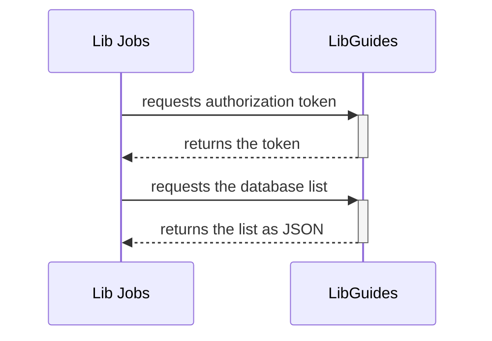

# Web Database List

This generates a CSV version of the database A-Z list in
libguides.

## Flow Diagram

## Configuration

This feed can be used with different client ids and secrets.

To find the client id and secret for your application:

1. Go to https://princeton.libapps.com
1. Log in via CAS
1. LibApps menu -> Libcal
1. Tools menu -> API
1. Open the API Authentication tab
1. The client id and secret can be found in
the Applications grid at the bottom
of the screen.

To configure the client id and secret in lib-jobs,
use the `LIBGUIDES_CLIENT_ID` and
`LIBGUIDES_CLIENT_SECRET` environment variables.
