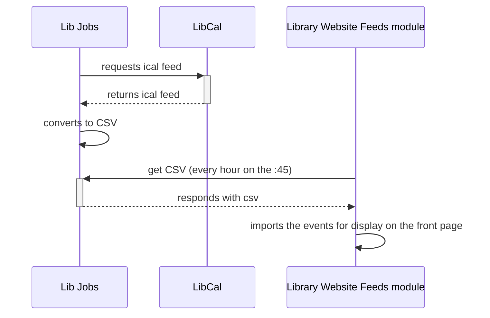

# Web Staff

This generates a CSV version of Libcal's ical feed or library events.
The CSV is to be used for the events display on the front page of the
[Library web site](https://library.princeton.edu).

You can find the CSV at /library-events.csv, and generate a new one with
`bundle exec rake lib_jobs:generate_events_csv`.

If the CSV has already been generated within the past hour, it will simply
return the existing CSV, rather than generating a new one.  If you'd like
to force the creation of a new CSV, you can delete the existing file
and run the rake task again.

## Flow Diagram

## Configuration

This feed can be used for any calendar in libcal. You
just need to configure it with the appropriate `cid`
and `k` values.

To find these values:

1. Go to https://princeton.libapps.com
1. Log in via CAS
1. LibApps menu -> Libcal
1. Press "Events"
1. Press the calendar you are interested in (defaults
to "Events and Workshops").
1. Open the "Embed/Export" tab.
1. Open the iCal Subscription section.
1. The `cid` and `k` values can be found in the
displayed URL.

To configure the values in lib-jobs, use the
`LIBCAL_CID` and `LIBCAL_K` environment variables.