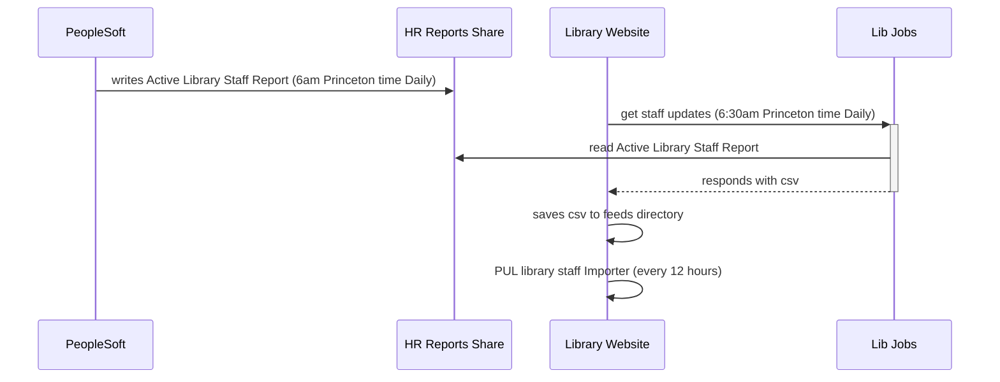

# Web Staff
  This generates the staff report that is read into the library website each day to make the [staff directory](https://library.princeton.edu/staff/directory).

## Flow Diagram

### Key
[get staff updates](https://github.com/pulibrary/princeton_ansible/blob/main/roles/libwww/files/get_staff_updates.sh)

[PUL library staff Importer](https://library.princeton.edu/admin/structure/feeds/pul_library_staff_importer/tamper)
